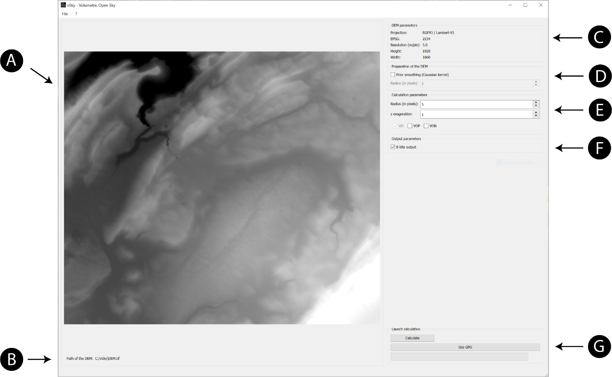
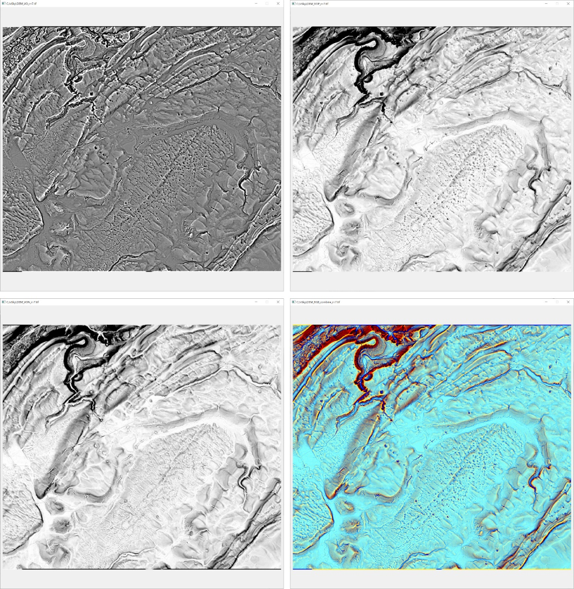

**Welcome to vSky2!**

Version 1.0

**Presentation**.

This software is part of the study published in Rolland, T.; Monna, F.;
Buoncristiani, J.F.; Magail, J.; Esin, Y.; Bohard, B.; Chateau-Smith, C.
Volumetric Obscurance as a New Tool to Better Visualize Relief from Digital
Elevation Models. RemoteSens. 2022, 14, 941.
<https://doi.org/10.3390/rs14040941>. See the file: remotesensing-14-00941.pdf

vSky2 aims at providing insights for scientists to reveal relief variations in
digital elevation models (DEMs). The three new algorithms implemented in vSky2
can be easily tuned to highlight small-scale and/or large-scale irregularities.
Outputs are provided as 32-bits GeoTIFF rasters, usable for further calculation
or integration in any GIS environments, and optionally, as 8-bits images
readable by any computer viewers or straightforwardly integrable in reports or
publications. These new DEM treatments are easily obtained, even with
consumer-grade computers. They may efficiently complement other available DEM
treatments, in extending interpretation capabilities in a broad field of
scientific activities: e.g. geology, geomorphology, hydrology, archaeology,
cultural heritage. vSky2 possesses a user-friendly, graphical user interface. A
standalone executable produced for Windows is provided together with a QGIS
plugin. That make them work out of the box, without any fancy installation.

**Window version**

**Installation**. Unzip the folder named vSky2.zip into the installation
directory of your choice. The created folder contains five files: a shortcut to
the exe file, a folder containing the software body, and four DEM examples,
Jura.tif, Mongolia.tif, Siberia.tif, and Tanzania.tif representing respectively
a part of a French mountainous area, funeral structures made of dry stones, rock
art, and part of the area near to the Ngorongoro Volcanic High Plateau which are
either discussed in the accompanying article or used as example in the present
user manual. Then, just run the exe.

**Opening a new DEM**. Only projected DEM in GeoTIFF format are accepted by
vSky2. Simply open the file of interest from the File menu. No data values should
be set at -32767 or 32767. The DEM, greyscale converted for visual examination,
appears in the ‘*DEM to be treated*’ frame (see A in Fig. 1). Its path is
recalled in the ‘*Path’* frame for facilitating further file manipulation (see B
in Fig. 1). Information about EPSG projection, resolution (in m/px), and size in
pixel of the DEM are reported in the ‘*DEM parameter*’ frame (see C in Fig. 1).
Please note that scaled, but arbitrarily projected DEM can also be treated (e.g.
try the Siberian file provided).

**DEM preparation**. In some circumstances, a preliminary smoothing of the DEM
decreasing the influence of high frequency surface irregularities may notably
improve results. To perform this step, check the ‘*Prior smoothing*’ box, and
set the radius of influence, expressed in pixels, for computing smoothing (see D
in Fig. 1).

****

**Figure 1:** Screenshot of the vSky2 software. The letters correspond to the
different frames.

**Calculation parameters**. The Volumetric Obscurance, namely VO, is always
calculated (see E in Fig. 1). Optionally, Positive and/or Negative Volumetric
Obscurances, namely VOP and VON, can also be added (see the accompanying article
for the calculation principles of these treatments). Once the processes are
chosen two parameters can be set: the radius of the influence sphere (in pixels)
and the vertical exaggeration factor. The first one must be adapted to the size
of the structures to be highlighted; low (high) values bring to the view small
(large) structures. The second one corresponds to a multiplying factor applied
to the values of the DEM. The procedure can be repeated until reaching
convenient results, as using different combinations of smoothing, exaggeration
and/or volumetric obscurance radii does not overwrite the existing files (see
below).

**Outputs**. All selected treatments are saved as 32-bits GeoTIFF rasters using
the same projection system than the input DEM. These files are adapted to
further use in GIS environments. Gray-scaled, 8-bits images are also generated
by truncating and rescaling the original histograms. First, the values below the
2th percentile and those above the 98th percentile are aggregated, and hence,
the new distribution is remapped onto the 0-255 range. The operator may choose
to save (or not) the resulting images in JPG format (see F in Fig. 1). If all
the processes are selected and the 8-bits option is validated, the program will
produce in supplement an RGB 8-bits image, which is the combination of VO, VOP,
and VON filling each of the three RGB channels. The interest of 8-bits outputs
is essentially visual, allowing rapid evaluation.

**Launch calculation.** Run the calculation with the ‘*Calculate*’ button (see G
in Fig. 1). The progression bar shows then the advancement of the computation.
Once done, the 8-bits images corresponding to the selected treatments are
displayed on screen (Fig. 2). All files are saved in the directory of the input
DEM, with the following names:

\<DEM file name\>*\<treatment name\>*\<8bits[^1]\>_r=\< VO
radius\>_smooth_r[^2]=\<smoothing radius\>_Z-exag3=\<exaggeration factor\>

[^1]: \-3 If applicable

[^2]: 

For configurations compatible with CUDA 10, the button ’Use GPU’ should be
checked. It allows to activate a GPU acceleration. The button appears in blue
when GPU acceleration is toggled.

**Figure 2**: From left to right and top to bottom: screenshots of the VO, VOP,
VON processes and RGB combination (8-bits outputs) for the example of the Jura
DEM.

|                     |                | Jura.tif (12 Mo) 1920x1660 (2.2 Mpix) |      |       | Tanzania.tif (100 Mo) 3638x7204 (26.2 Mpix) |      |        |
|---------------------|----------------|---------------------------------------|------|-------|---------------------------------------------|------|--------|
|                     | radius (px)    | 5                                     | 10   | 50    | 5                                           | 10   | 50     |
| Classic computation | Time (min:sec) | 0:15                                  | 1:06 | 28:06 | 2:09                                        | 9:31 | 240:24 |
| GPU accelerated     | Time (min:sec) | 0:01                                  | 0:02 | 0:37  | 0:02                                        | 0:09 | 3:47   |

**Table 1**: Time required for computing VO, VOP, and VON for two DEMs of
different sizes, as a function of the radius (using a i9-9980XE CPU equipped
with 128 Go of RAM and a Nvidia RTX 2080).

**Computation time and advice**. The GPU acceleration allows to process a DEM
rapidly, but for a very large DEM or large radius, it can become demanding in
memory. On the other hand, vSky2 does not use multithreading in order to limit
memory consumption. Relatively large DEM can therefore be processed, even with a
consumer-grade computer, but calculation may take a while. Time roughly
increases linearly with DEM size, and more importantly, with the square of the
influence radius (Table 1), because evaluation is made at each pixel of the DEM
by scanning each pixel contained within a radius circle. As a result, rather
than choosing high radius, it is preferable to set a smaller radius after
resolution reduction of the DEM. That produces comparable results. Depending on
the available RAM, mosaicking very large DEM in several smaller quadrangles,
overlapping on the four sides, may also be recommended. An overlap greater than
the influence radius allows further merging, eliminating edge effects generated
by the different treatments.

**QGIS version**

**Installation**. The vSky2 plugin supports QGIS 3.34 or newer, including QGIS
3.44 LTR and QGIS 4.x, on Windows and macOS. The plugin archive must be installed
from Plugins / Manage and Install Plugins… / Install from ZIP, then enabled from
the Installed tab.

**Workflow**. The principles of use with QGIS are the same than with the Windows
version, except that 8-bit outputs are not proposed (Fig. 3). If necessary, they
can be obtained by changing the properties dialog panel of the layer.

**Figure 3**: Screenshot of the vSky2 plugin panel in QGIS.

**Programming**

The plugin uses the Python, Qt compatibility layer, GDAL, and NumPy versions
provided by QGIS. CuPy support is optional and only enables CUDA acceleration
when a compatible installation is available. The software is freely available,
without any warranty about the relevance of the produced results.
